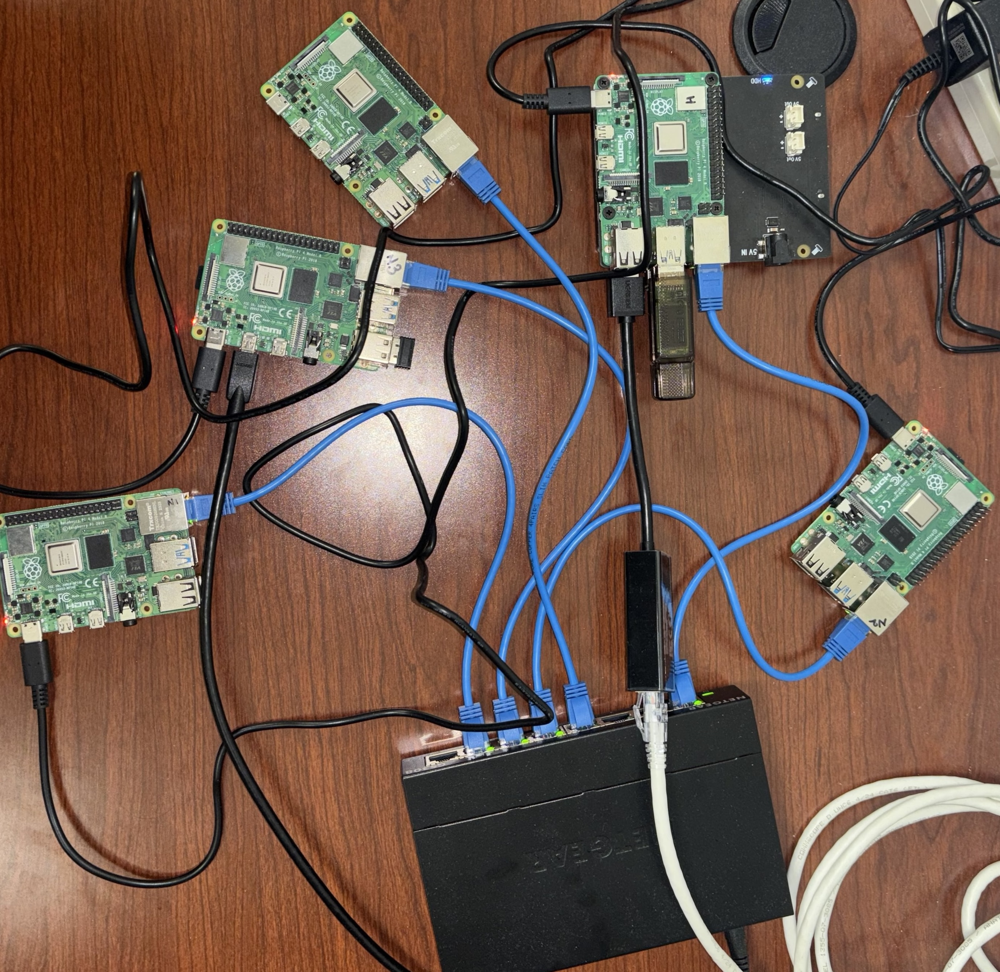

# Raspberry Pi Cluster (RHEL 9 + SLURM)

This project documents how I built a distributed Raspberry Pi cluster running Rocky Linux 9 with SLURM for job scheduling. The cluster replicates NJIT’s production HPC environment at a smaller scale, serving as a sandbox for testing, learning HPC concepts, experimenting with cluster management tools.  

- **Head Node**: 1 Raspberry Pi 4 (control + NFS + DHCP + TFTP + SLURM controller)  
- **Compute Nodes**: 4 Raspberry Pi 4 (diskless PXE-booted via network switch)  
- **Networking**: 5-port Netgear Ethernet switch  
- **Storage**: NFS shares + local scratch on compute nodes  
- **Software**: Rocky Linux 9, SLURM, Munge, Spack, Lmod  

Full setup guide with commands and troubleshooting is available in the [documentation PDF](./docs/RaspberryPI%20Cluster%20with%20Rocky.pdf).  

## Architechture

Cluster includes total of 5 nodes out of which one is "head" (controller node) and rest 4 are compute nodes. They are all connected via Network Switch with ethernet cables. Head node is connected to outside internet and compute nodes's wifi is blacklisted to avoid outside access. So there is just one point of entry in the cluster for security. I created a chroot environment on head node with a minimal RHEL 9 which is being served to all compute nodes via NFS. Head node is connected to high speed 2TB SSD which is also shared throughout the cluster. Each compute node as its own local storage mounted via 64GB SD cards. Its important so that compute nodes and store the results in its local instead of sending it to main ssd via ethernet which can be very slow. All the compute nodes pxe boot by getting bootloader from head node via NFS. SLURM is installed throughout the cluster for job schedulling.  

## Features

- **Diskless PXE Booting** – Compute nodes boot over the network with a shared Rocky Linux image.
- **SLURM Integration** – Configured for job scheduling across head + compute nodes.
- **Spack + Lmod** – Software package builds and module management.
- **Shared Storage** – `/project` and `/software` mounted from SSD via NFS; `/scratch` auto-mounted locally per node.
- **Monitoring & Utilities** – Scripts for node status checks, automated shutdowns, and time synchronization with Chrony.

## Use Cases

- Test Linux administration scripts safely before production.
- Learn SLURM job submission and resource scheduling.
- Demonstrate distributed computing concepts with a small cluster.
- Play around with Lmod for understanding how software modules are structured for HPC clusters